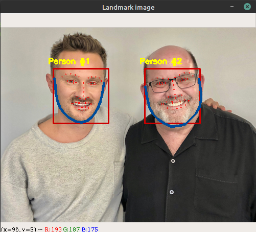

### Use Python 3x

## Installation Guide:

## Prerequisites for installing dlib:
`$ sudo apt-get install build-essential cmake`
`$ sudo apt-get install libgtk-3-dev`
`$ sudo apt-get install libboost-all-dev`

## Install virtual environment: 
`virtualenv -p python3 envname` 
## Activate the environment: 
`source envname/bin/activate`
## Install the requirements using requirements.txt file: 
`$ pip install -r requirements.txt`

## Run the file: 
`$ python detect.py`

## About the project:
* This project aims to detect facial region and plot landmark points in an image.
* It uses `cv2` and `dlib` library for the same. 
* `dlib` is a C++ toolkit for plotting facial  landmark  points.
* The `dat file` enables to load the pretrained facial landmark predictor using the path to the supplied shape-predictor.
* The text file output contains coordinates of all the 68 landmark points of each face detected in the image.
* The output also shows an image, wherein along with the landmarks, the jawline of the individual can also be traced.

## Output	

